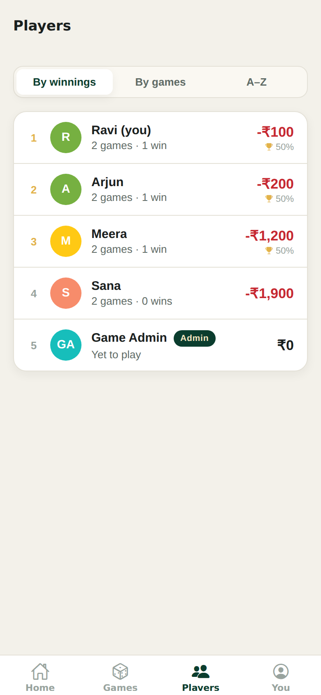

# AndarBaharApp

A game-night ledger for iOS and Android. It keeps track of who played, what
they put in, what they took out, who won, and what the night cost.

Every player gets their own login and can see the whole ledger. An admin
records the games and manages the group.

<p align="center">
  
  
  
</p>

## What it does

**Games.** Date, where it was played, who sat down, and who held the bank.
The name and the room fill themselves in — *Saturday-Regular*, *Katte Room* —
so recording a night is mostly typing numbers.

**Chips.** *Cash-in* is what a player bought from the banker; *cash-out* is
what they cashed back in, before any of the night's costs. Chips come from the
banker and go back to the banker, so the two totals have to match:

```
total cash-in  =  total cash-out
```

The app checks that as you type and says how far out it is, rather than
quietly recording a night that does not add up.

**What the night cost.** Dinner, drinks, the new decks, the cab — picked from a
list rather than typed out, with dinner the default. **Dinner is always on
whoever won the most**, worked out from the numbers, so there is nothing to
choose. Correct someone's cash-out weeks later and the bill follows whoever
that makes the top winner. Anything else is carried by whoever says they will —
one person, or split evenly between several.

**Net.** A player's real result, worked out for them:

```
net  =  (cash-out - cash-in)  -  their share of the night's costs
```

Nobody is marked as the winner by hand. Anyone who finishes ahead counts as a
win; the single biggest result is the one who buys dinner.

**Players.** Add someone and they get their own login on the spot, with a
one-time password you can send them. Every player sees every game, the
leaderboard, and their own history: nights played, win rate, lifetime net, best
and worst nights.

**Admin.** One account with full control: records and edits games, adds
players, renames anyone, promotes other admins, resets passwords, and deletes
anything that was entered wrong.

## Getting it online

Most people want this on the internet, not on a laptop — so friends can open a
link and add the app to their home screen. **[DEPLOYMENT.md](DEPLOYMENT.md)**
walks through that start to finish: about 20 minutes, free, no command line.

The short version: a free Postgres database from [Neon](https://neon.com), then
one click on [Render](https://render.com), which reads `render.yaml` and puts up
both the API and the app.

## Installing it on a phone

There is no app store step. Open the address in a phone browser and the app
offers to add itself to the home screen — one tap on Android, Share → *Add to
Home Screen* on an iPhone. After that it runs full screen with its own icon,
like any other app, and updates itself whenever you deploy.

Proper store builds are possible later (`npx eas build`); see the end of
DEPLOYMENT.md for what that costs and what Apple asks about.

## Running it on your own machine

You need [Node](https://nodejs.org) 20 or newer and a PostgreSQL database. The
quickest way to get the database is Docker:

```bash
git clone <this repo>
cd andarbaharapp
npm install --legacy-peer-deps

docker compose up -d          # Postgres on port 5432

cp server/.env.example server/.env
# fill in DATABASE_URL and JWT_SECRET - the file explains both
```

No Docker? Any Postgres will do, including a free Neon database. Put its
connection string in `DATABASE_URL` and skip the `docker compose` line.

Then:

```bash
npm run db:setup   # applies migrations, creates the admin account
npm run server     # API on http://localhost:4000
npm run mobile     # Expo dev server, in another terminal
```

The admin account comes from `server/.env`. Leave `ADMIN_PASSWORD` blank and it
falls back to `admin123`, which the app forces you to change on first sign-in.

To start with something to look at:

```bash
SEED_DEMO_DATA=true npm run db:seed
```

That adds `ravi`, `meera`, `arjun` and `sana`, all with the password
`andar123`, across two game nights.

### Opening the app

- **On your phone** — install [Expo Go](https://expo.dev/go) and scan the QR
  code. It finds the API by itself, as long as the phone and the computer are
  on the same Wi-Fi.
- **iOS simulator** — press `i` (needs Xcode, so macOS).
- **Android emulator** — press `a` (needs Android Studio).
- **In a browser** — press `w`.

If the app cannot reach the API, tap **Server** on the sign-in screen and type
the address in — `http://192.168.1.5:4000`, say. It is remembered. (That option
is hidden in deployed builds, where the address is fixed.)

## How it is put together

```
server/    Express + Prisma API over PostgreSQL
mobile/    Expo (React Native) app for iOS, Android and the web
```

The web build is a progressive web app: a manifest, a service worker and an
in-app installer, so a phone can add it to the home screen and run it full
screen. That is what makes "send your friends a link" work without an app
store.

### Money

Every amount is stored as an integer number of **paise**. Floating point
belongs nowhere near a ledger people argue over: `0.1 + 0.2` is not `0.3`, and
a rupee that goes missing in rounding is a rupee someone has to explain.
Formatting happens only at the edge, in `mobile/src/utils/money.ts`.

Splitting an odd amount hands the leftover paise out one at a time in a stable
order, so the shares always add back up to exactly what was spent.

### Ledgers are derived, never stored

Nothing about a result is saved — not the net, not who won, not who owes for
dinner. It is all worked out from the chips and the costs as they stand right
now, so correcting a cash-out three weeks later moves every number that depends
on it, including which player the dinner bill lands on.
`server/src/services/ledger.service.ts` holds the whole calculation, and it is
the part covered by the most tests.

The top winner is judged on the **table** result rather than the final net, and
deliberately so: dinner lands on that player, so picking them from a number
dinner has already changed would chase its own tail.

Note that the table is collectively *down* by whatever the night cost — that
money went to the restaurant. Sum everyone's net for a game and you get the
costs back, negated. That is the books being right, not wrong.

### Who can do what

| | Player | Admin |
| --- | --- | --- |
| See every game, player and payment | yes | yes |
| Edit their own profile and password | yes | yes |
| Record and edit games, expenses, players | no | yes |
| Rename anyone, reset passwords, change roles | no | yes |
| Delete games and players | no | yes |

A few rules are deliberate rather than incidental:

- **Dinner is always on whoever won the most**, resolved by the server from the
  numbers rather than taken from whatever the app sends.
- **Winning is not something anyone ticks.** Finish ahead once the costs come
  off and it counts as a win; several people can win the same night, but only
  the biggest result buys dinner.
- **One banker per game**, because somebody has to be holding the cash.
- **The last active admin cannot be demoted or deactivated**, so the group
  cannot lock itself out.
- **Deleting a player who has played deactivates them instead**, so past games
  stay intact.
- **Changing a password, resetting one, or deactivating an account retires the
  existing sign-in tokens.**
- **Failed sign-ins are rate limited** — ten per IP per fifteen minutes, with
  successful ones not counted, so nobody gets locked out for fumbling their own
  password while a stranger still cannot guess their way in.

## Development

```bash
npm test           # 46 tests: the night's arithmetic and the API end to end
npm run typecheck  # both halves
npm run server     # API with reload on save
npm run mobile     # Expo dev server
```

The tests need a Postgres to talk to — `docker compose up -d` provides one, and
they use a separate `aadarbahar_test` database so your own data is never
touched. Point `TEST_DATABASE_URL` somewhere else if you prefer. They cover the
night's arithmetic (balancing, rounding, what happens when it does not add up)
and the API end to end: sign-in, roles, game CRUD, the dinner-on-the-top-winner
rule, splitting a cost between players, history and statistics.

### API

All routes live under `/api` and need `Authorization: Bearer <token>` except
`/api/health` and `/api/auth/login`.

| Method | Route | |
| --- | --- | --- |
| `POST` | `/auth/login` | Sign in |
| `GET` `PATCH` | `/auth/me` | Your account |
| `POST` | `/auth/change-password` | Returns a fresh token |
| `GET` | `/dashboard` | Home screen figures |
| `GET` `POST` | `/players` | Roster · add (admin) |
| `GET` | `/players/leaderboard` | Ranked by lifetime net |
| `GET` | `/players/:id` | Profile, stats and history |
| `PATCH` `DELETE` | `/players/:id` | Edit · remove (admin) |
| `POST` | `/players/:id/reset-password` | Admin |
| `GET` `POST` | `/games` | List · record (admin) |
| `GET` `PATCH` `DELETE` | `/games/:id` | One game |
| `POST` `PATCH` `DELETE` | `/games/:id/players[/:seatId]` | Seats (admin) |
| `POST` `PATCH` `DELETE` | `/games/:id/expenses[/:expenseId]` | Costs (admin) |

### Why PostgreSQL

The app started on SQLite, which is lovely on a laptop and useless the moment
you host it — the free hosts hand you a fresh, empty disk on every deploy, so a
database that lives in a file is a database that disappears. Postgres is the
same everywhere, and the test suite runs against it too, so a migration that
would fail in production fails locally first.

## Licence

MIT.
