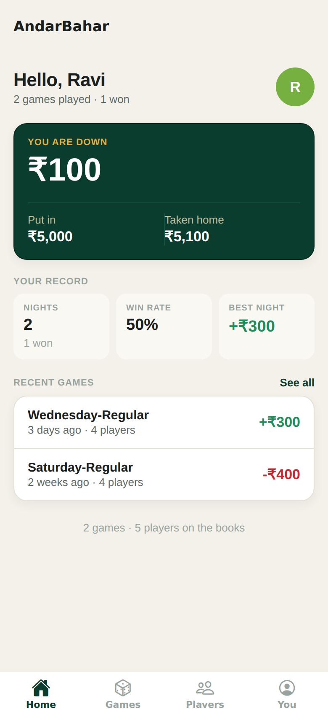
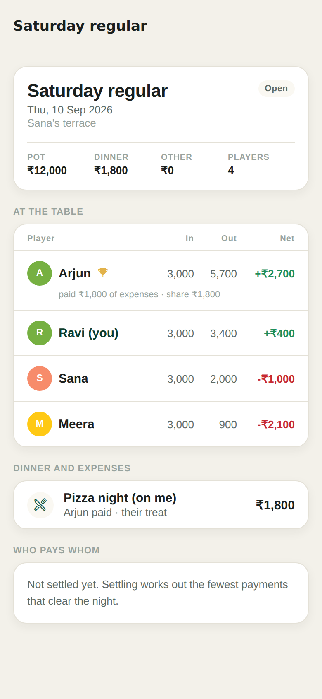
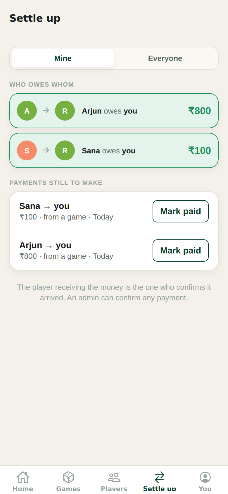

# AadarBaharApp

A game-night ledger for iOS and Android. It keeps track of who played, what
they put in, what they took out, who won, what dinner cost, and — the part that
usually causes the arguments — who owes whom afterwards.

Every player gets their own login and can see the whole ledger. An admin
records the games and manages the group.

<p align="center">
  
  
  
</p>

## What it does

**Games.** Date, location, everyone at the table, each player's buy-in and
cash-out, and who won. The app adds up the pot as you type and tells you when
the cash-outs don't match the buy-ins, before you save something that will not
reconcile.

**Dinner and expenses.** Any cost attached to a night, split three ways:

| Split | What it means |
| --- | --- |
| `EQUAL` | Shared across everyone seated. Add a latecomer and it re-splits itself. |
| `CUSTOM` | You set each person's share by hand. They have to add up to the total. |
| `PAYER` | Whoever paid is treating the table and carries the whole cost. |

**Settling up.** Settling a game nets each player's position — table result,
minus their share of the expenses, plus whatever they fronted — and works out
the *fewest* payments that clear the night. Four players settle in three
payments, not twelve. Outstanding IOUs across all games net down to one line
per pair of people.

**Players.** Add someone and they get their own login on the spot, with a
one-time password you can send them. Every player sees every game, the
leaderboard, and their own history: games played, win rate, lifetime net, best
and worst nights.

**Admin.** One account with full control: records and edits games, adds and
removes players, promotes other admins, resets passwords, records payments by
hand, and deletes anything that was entered wrong.

## Getting it online

Most people want this on the internet, not on a laptop — so friends can open a
link and add the app to their home screen. **[DEPLOYMENT.md](DEPLOYMENT.md)**
walks through that start to finish: about 20 minutes, free, no command line.

The short version: a free Postgres database from [Neon](https://neon.com), then
one click on [Render](https://render.com), which reads `render.yaml` and puts up
both the API and the app.

## Installing it on a phone

There is no app store step. Open the address in a phone browser and the app
offers to add itself to the home screen — one tap on Android, Share → *Add to
Home Screen* on an iPhone. After that it runs full screen with its own icon,
like any other app, and updates itself whenever you deploy.

Proper store builds are possible later (`npx eas build`); see the end of
DEPLOYMENT.md for what that costs and what Apple asks about.

## Running it on your own machine

You need [Node](https://nodejs.org) 20 or newer and a PostgreSQL database. The
quickest way to get the database is Docker:

```bash
git clone <this repo>
cd andarbaharapp
npm install --legacy-peer-deps

docker compose up -d          # Postgres on port 5432

cp server/.env.example server/.env
# fill in DATABASE_URL and JWT_SECRET - the file explains both
```

No Docker? Any Postgres will do, including a free Neon database. Put its
connection string in `DATABASE_URL` and skip the `docker compose` line.

Then:

```bash
npm run db:setup   # applies migrations, creates the admin account
npm run server     # API on http://localhost:4000
npm run mobile     # Expo dev server, in another terminal
```

The admin account comes from `server/.env`. Leave `ADMIN_PASSWORD` blank and it
falls back to `admin123`, which the app forces you to change on first sign-in.

To start with something to look at:

```bash
SEED_DEMO_DATA=true npm run db:seed
```

That adds `ravi`, `meera`, `arjun` and `sana`, all with the password
`andar123`, across two game nights.

### Opening the app

- **On your phone** — install [Expo Go](https://expo.dev/go) and scan the QR
  code. It finds the API by itself, as long as the phone and the computer are
  on the same Wi-Fi.
- **iOS simulator** — press `i` (needs Xcode, so macOS).
- **Android emulator** — press `a` (needs Android Studio).
- **In a browser** — press `w`.

If the app cannot reach the API, tap **Server** on the sign-in screen and type
the address in — `http://192.168.1.5:4000`, say. It is remembered. (That option
is hidden in deployed builds, where the address is fixed.)

## How it is put together

```
server/    Express + Prisma API over PostgreSQL
mobile/    Expo (React Native) app for iOS, Android and the web
```

The web build is a progressive web app: a manifest, a service worker and an
in-app installer, so a phone can add it to the home screen and run it full
screen. That is what makes "send your friends a link" work without an app
store.

### Money

Every amount is stored as an integer number of **paise**. Floating point
belongs nowhere near a ledger people argue over: `0.1 + 0.2` is not `0.3`, and
a rupee that goes missing in rounding is a rupee someone has to explain.
Formatting happens only at the edge, in `mobile/src/utils/money.ts`.

Splitting an odd amount hands the leftover paise out one at a time in a stable
order, so the shares always add back up to exactly what was spent.

### Ledgers are derived, never stored

A player's net for a game is worked out from the game as it stands right now:

```
net = (cash-out - buy-in) - their share of the expenses + what they paid for
```

Nothing is cached. Correct a buy-in three weeks later and every history,
statistic and leaderboard position follows automatically. `server/src/services/
ledger.service.ts` holds the whole calculation, and it is the part covered by
the most tests.

### Who can do what

| | Player | Admin |
| --- | --- | --- |
| See every game, player and payment | yes | yes |
| Edit their own profile and password | yes | yes |
| Confirm money paid **to them** | yes | yes |
| Record and edit games, expenses, players | no | yes |
| Reset passwords, change roles, delete things | no | yes |

A few rules are deliberate rather than incidental:

- **The player being paid confirms the payment**, not the one paying — they are
  the one with something to lose from a wrong tap.
- **Re-settling a game refuses to wipe payments already marked paid** unless
  you confirm.
- **The last active admin cannot be demoted or deactivated**, so the group
  cannot lock itself out.
- **Deleting a player who has played deactivates them instead**, so past games
  stay intact.
- **Changing a password, resetting one, or deactivating an account retires the
  existing sign-in tokens.**
- **Failed sign-ins are rate limited** — ten per IP per fifteen minutes, with
  successful ones not counted, so nobody gets locked out for fumbling their own
  password while a stranger still cannot guess their way in.

## Development

```bash
npm test           # 53 tests: ledger maths and the API end to end
npm run typecheck  # both halves
npm run server     # API with reload on save
npm run mobile     # Expo dev server
```

The tests need a Postgres to talk to — `docker compose up -d` provides one, and
they use a separate `aadarbahar_test` database so your own data is never
touched. Point `TEST_DATABASE_URL` somewhere else if you prefer. They cover
rounding, the three split modes, transfer minimisation, IOU netting, and the
API end to end: sign-in, roles, game CRUD, settling, history and statistics.

### API

All routes live under `/api` and need `Authorization: Bearer <token>` except
`/api/health` and `/api/auth/login`.

| Method | Route | |
| --- | --- | --- |
| `POST` | `/auth/login` | Sign in |
| `GET` `PATCH` | `/auth/me` | Your account |
| `POST` | `/auth/change-password` | Returns a fresh token |
| `GET` | `/dashboard` | Home screen figures |
| `GET` `POST` | `/players` | Roster · add (admin) |
| `GET` | `/players/leaderboard` | Ranked by lifetime net |
| `GET` | `/players/:id` | Profile, stats, history, balances |
| `PATCH` `DELETE` | `/players/:id` | Edit · remove (admin) |
| `POST` | `/players/:id/reset-password` | Admin |
| `GET` `POST` | `/games` | List · record (admin) |
| `GET` `PATCH` `DELETE` | `/games/:id` | One game |
| `POST` `PATCH` `DELETE` | `/games/:id/players[/:seatId]` | Seats (admin) |
| `POST` `PATCH` `DELETE` | `/games/:id/expenses[/:expenseId]` | Costs (admin) |
| `GET` | `/games/:id/settlement-preview` | The split, without saving it |
| `POST` | `/games/:id/settle` · `/reopen` | Admin |
| `GET` `POST` | `/settlements` | IOUs · record one by hand (admin) |
| `GET` | `/settlements/outstanding` | Netted per pair |
| `PATCH` `DELETE` | `/settlements/:id` | Mark paid · remove |

### Why PostgreSQL

The app started on SQLite, which is lovely on a laptop and useless the moment
you host it — the free hosts hand you a fresh, empty disk on every deploy, so a
database that lives in a file is a database that disappears. Postgres is the
same everywhere, and the test suite runs against it too, so a migration that
would fail in production fails locally first.

## Licence

MIT.
